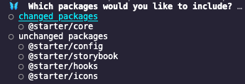
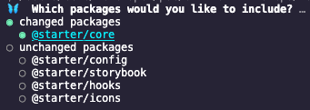

# CONTRIBUTING

We are following [Semantic Versioning](https://semver.org/) and [Conventional Commits](https://www.conventionalcommits.org/en/v1.0.0/). <br/>
When contributing to this repository, please follow the steps below.

### Semantic Versioning Reminder

> PATCH: refactor, internal or non-breaking change which fixes an issue
>
> MINOR: non-breaking change which adds functionality
>
> MAJOR: fix or feature that would cause existing functionality to not work as expected

### Conventional Commits Reminder

Always try to add the library you've been working on between `()`

- For instance, if adding a new component in core package.

```bash
git commit -m "feat(core): adding a new component"
```

- For instance, if fixing an issue

```bash
git commit -m "fix(icons): change correct name to AddUser icon"
```

- If touching configuration

```bash
git commit -m "chore(dep): updating eslint configuration"
```

## Branches

We already have `fix` and `feat` branches created to work on `libs` packages:

- `fix/advanced` or `feat/advanced`
- `fix/core` or `feat/core`
- `fix/hooks` or `feat/hooks`
- `fix/icons` or `feat/icons`

We already have an `update/docs` branch to work on `Storybook`

---

⚠️ Don't use or push on `main` branch. This branch is used to merge and publish packages.

---

## Dev

- Before starting any development, please rebase the main branch.
- Checkout to your own development branch if different from information above.
- Rebase this branch with main branch.
- Start developing!
- Then, read CHANGESET section.

## Changeset

- Before adding your changes, please run `yarn changeset`



- Select the lib you worked on with `Space` and then press `Enter`



- Select the right bump version with `Enter` and select package with `Space`


- When questioning about bump other packages, please, enter No.

- Add a summary about your work.
- Say `Yes` to next prompt.
- Add changeset to your tracked files.
- Commit and push your work.

## Pull Request

- After pushing your work, create a Pull Request
- Select `main` branch as base branch.
- Add a clear title if your commit message is not there.
- Leave a comment if desired
- Create your Pull Request and then fill the checkboxes of the PR Template

---

⚠️ If you forgot to add a `changeset`, `changeset-bot` will warn you. <br/>

Please click the second link inside `changeset-bot` to manually add a changeset and add the right bump version (PATCH, MINOR)

---

- Add a reviewer

## What's next ?

- Your Pull Request will be analyzed by Changeset Action Bot.
- An automatic `Release Pull Request` will be created through Github Actions.
- Release Manager or Maintainer of ODE React UI will merge this PR.
- Packages will be updated on NPM.
